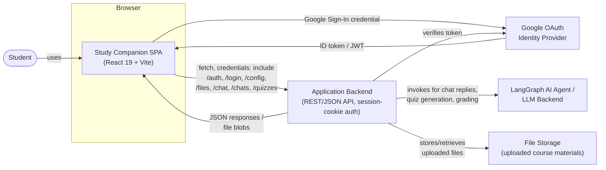
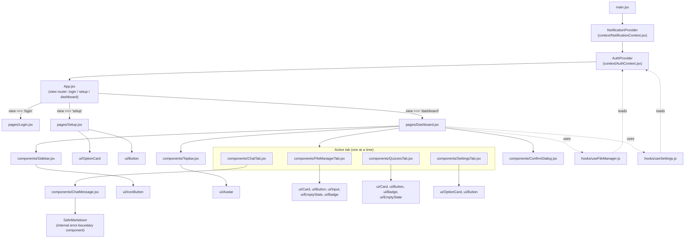
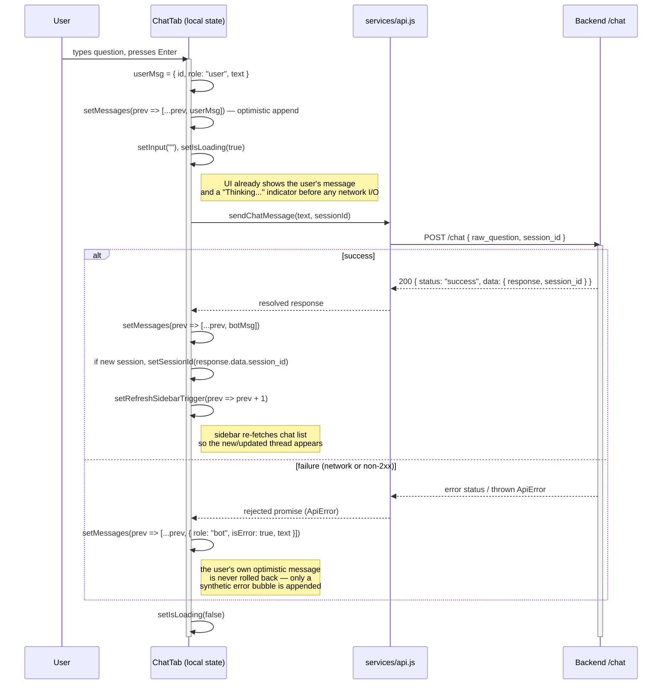

# Study Companion — Technical Documentation

**Scope of this document.** This documentation describes the system **as it is actually implemented** in this repository today. It is not a target-architecture proposal and it does not describe technologies that are not present in the codebase. Every claim below is traceable to a specific file. Where a capability does not exist yet (offline support, streaming AI responses, a spaced-repetition "Deck" model), this document says so explicitly rather than inventing it, because a documentation file that describes fictional infrastructure is worse than no documentation at all — it actively misleads whoever reads it next.

Verified stack: **React 19 + Vite 8**, plain **JavaScript/JSX** (no TypeScript), plain **CSS with custom properties** (no Tailwind), a **hand-built UI component kit** (no shadcn/ui), **React Context + local component state** (no Zustand), and a **manual `fetch`-based API layer** (no TanStack Query). These are documented and justified on their own terms in Section 3.

---

## Table of Contents

1. [System Overview](#1-system-overview)
2. [UI Architecture & Data Flow](#2-ui-architecture--data-flow)
3. [Technology Stack & Justifications](#3-technology-stack--justifications)
4. [Project Directory Structure](#4-project-directory-structure)
5. [State Management Strategy](#5-state-management-strategy)
6. [AI Integration & Rendering](#6-ai-integration--rendering)
7. [API Contracts](#7-api-contracts)

---

## 1. System Overview

### 1.1 What this system is

Study Companion is a single-page web application (SPA) that gives engineering and mathematics students an AI tutor chat, a file/document manager for course materials, and an AI-generated quiz system that turns a chat conversation into a graded multiple-select quiz. The frontend in this repository is a pure client — it holds no business logic beyond UI state, optimistic rendering, and request orchestration. All authentication, AI reasoning, quiz generation/grading, and file storage are delegated to a backend service reached over HTTP.

### 1.2 High-level architecture

The application is a **client-rendered SPA built with Vite**, not a server-rendered or statically-generated app. There is no meta-framework, no file-system router, and no server components — `index.html` loads a single JS bundle produced by Vite, React mounts into `#root` (`src/main.jsx`), and from that point forward the entire application lifecycle — routing, data fetching, rendering — happens in the browser.

The backend is not part of this repository, but its shape is fully inferable from `src/services/api.js`: it exposes a REST-ish JSON API (endpoint families under `/auth`, `/login`, `/config`, `/files`, `/chat`, `/chats`, `/quizzes`) fronted by cookie-based session authentication (every request is sent with `credentials: 'include'`, and the backend sets an httpOnly session cookie on login rather than the client managing a bearer token). Login itself is delegated to **Google OAuth**: the frontend never sees or stores a password, it hands a Google-issued credential JWT to the backend at `POST /login/google`, and the backend is responsible for verifying it and minting the application session. Quiz generation (`POST /chats/:session_id/quiz`) is described in code comments as invoking a **LangGraph-based backend agent**, i.e. the AI reasoning and quiz-authoring logic live entirely server-side; the frontend's job is limited to triggering the job and rendering the structured result it gets back.

There is no client-side database, no GraphQL layer, and no WebSocket connection. Every piece of state the UI needs — the user's identity, their uploaded files, their chat history, their quizzes — is fetched fresh from the backend on demand and held in React state for the lifetime of the tab.

### 1.3 Offline capabilities

**There are none, and this is a real, current gap rather than an oversight this document is glossing over.** Concretely, verified by inspection:

- No service worker is registered anywhere (`main.jsx` performs a plain `ReactDOM.createRoot(...).render(...)` with no `navigator.serviceWorker.register(...)` call).
- There is no PWA manifest (`manifest.json`) and no `vite-plugin-pwa` (or equivalent) in `package.json`.
- There is no IndexedDB, Cache API, or other durable client-side storage.
- The only persistence outside of React state is a single `localStorage` key, `userName`, written and read in `src/context/AuthContext.jsx`. It exists purely as a cosmetic optimization — it lets the app render the user's display name immediately on reload without waiting for `checkAuthSession()` to resolve — and it is **not** a cache of any server data; it holds no files, no chat history, no quiz content, and nothing that would let the app function while the network is down.

Practically, this means: without a network connection, the app can show a stale "Loading..." state and the last-known username, but every tab (Files, AI Tutor, Quizzes, Settings) is non-functional, because every one of them fetches its data from the backend on mount with no fallback. If offline support becomes a requirement, the natural next step (not implemented today) would be a service worker for the app shell plus an IndexedDB-backed cache for chat history and quiz data, invalidated on reconnect — but that is future work, not current behavior.

### 1.4 Core user flows

**Flow A — First login.**
1. The user lands on `Login` (`src/pages/Login.jsx`), which renders the Google Sign-In button via `@react-oauth/google`.
2. On success, `App.jsx::handleGoogleSuccess` receives a Google credential response. It locally decodes the JWT payload (base64, no verification — this is purely to extract the display name for immediate UI feedback, not a security boundary) and simultaneously calls `api.loginWithGoogle(googleToken)`, which posts the raw token to the backend at `POST /login/google?token=...`.
3. The backend verifies the token, creates/looks up the user, sets the session cookie, and returns `{ user_id, config }`.
4. `AuthContext::login(id, name)` stores `userId`/`userName` in React state and mirrors `userName` to `localStorage`.
5. If the returned `config.language` is falsy (i.e., this is a brand-new account with no saved preferences), `App` routes to `Setup`; otherwise it applies the saved theme (`document.documentElement.setAttribute('data-theme', ...)`) and routes straight to `Dashboard`.

**Flow B — Returning visit (session restore).**
1. On mount, `AuthProvider` fires `api.checkAuthSession()` (`GET /auth/check`), relying entirely on the session cookie already present in the browser.
2. While this resolves, `isLoading` is `true` and `App` renders a bare "Loading..." screen — this exists specifically to prevent a flash of the login screen for an already-authenticated user.
3. On success, `userId` is populated and `App`'s `useEffect` flips `view` to `'dashboard'`. On failure (no/expired cookie), the app quietly falls through to the login screen — the failure is caught and logged, not surfaced as an error toast, because "not logged in yet" is an expected state, not a fault.

**Flow C — Session expiry mid-use.** `services/api.js` exposes `registerApiHandlers({ onUnauthorized })`, a plain-module callback bridge (see Section 5.1 for why this indirection exists). Any request that comes back `401`/`403` triggers this callback exactly once per session (deduplicated via `App.jsx`'s `hasHandledExpiryRef`, so a burst of concurrently in-flight requests that all 401 together doesn't produce a stack of duplicate toasts), which shows a "Session expired" warning toast and calls `AuthContext::clearSession()` — a local-only reset that does *not* call `logoutUser()` again (that would itself 401 and be redundant).

**Flow D — Studying via AI Tutor chat.** The user opens the **AI Tutor** tab (`ChatTab.jsx`), types a question, and hits Enter or the send button. The message is optimistically appended to the on-screen conversation immediately (see Section 5.2), the request goes to `POST /chat` with `{ raw_question, session_id }`, and the assistant's single, complete JSON response (rendered through the Markdown/LaTeX pipeline in Section 6) is appended once it returns. If this is the first message of a new conversation, the backend mints a `session_id` which is then reused for every subsequent message in that thread and is what makes the conversation resumable from the sidebar.

**Flow E — Chat → Quiz generation.** From the chat history list in `Sidebar.jsx`, the user opens a chat's overflow menu and picks **Generate Quiz**, which calls `POST /chats/:session_id/quiz`. The backend's LangGraph agent reads that chat's history and synthesizes a structured multiple-select quiz. The response's `quiz_id` is used to immediately navigate the user into `QuizzesTab` with that quiz pre-loaded.

**Flow F — Taking and grading a quiz.** `QuizzesTab.jsx` renders one question at a time with a progress bar, lets the user select one-or-more options per question (`selectedAnswers` keyed by question index), and only enables **Submit** once every question has at least one selection. Submission posts the full answer map to `POST /quizzes/:quiz_id/grade` in one shot; grading itself — determining correctness and writing the per-question AI explanation — happens server-side. The returned `results` are then used to re-color every already-rendered option (correct in green, incorrectly-selected in red) and reveal the AI's explanation text, without re-fetching or re-rendering the quiz from scratch.

**Flow G — File management.** In the **My Files** tab, the user can create a subject/folder, upload one or more files into it (via `XMLHttpRequest`-based upload with a real progress bar — see Section 3), browse/search their uploaded files, download them, or delete a file or an entire subject (behind a shared `ConfirmDialog`). Uploaded files are what the backend later retrieves and cites when answering chat questions (see the `file://` link handling in Section 6.2).

---

## 2. UI Architecture & Data Flow

### 2.1 System Context Diagram



**Reading this diagram:** the SPA never talks to Google or to the AI agent directly except for the one-time OAuth handshake — the backend is the sole integration point for AI reasoning, session validation, and file storage. This matters architecturally: it means every AI/LLM cost, prompt, and credential lives server-side, and the frontend only ever renders results it's handed.

### 2.2 Component Tree Diagram



**Reading this diagram:** `Dashboard.jsx` is the composition root for the authenticated app — it owns navigation state (`activeTab`, `isCollapsed`) and session-scoped IDs (`activeSessionId`, `activeQuizId`), instantiates the two domain hooks, and prop-drills their state/actions down into the tab that's currently active. No tab component talks to `AuthContext` or `NotificationContext` directly except through the domain hooks or `useAuth`/`useNotify`, which keeps the tree shallow and avoids a second layer of prop-drilling for auth/toast concerns.

### 2.3 State Mutation Flow Diagram — Chat Send (the app's one real optimistic-update path)



**Why this is the representative "state mutation" flow for this codebase:** it's the only place the UI updates local state *before* a request resolves and reconciles afterward. Every other mutation in the app (file upload, file delete, subject delete, settings save, quiz submission) is **pessimistic** — it waits for the server's response and only then updates state, typically by re-fetching. Section 5.2 documents this contrast in detail, since it's the crux of the app's actual state-management strategy.

---

## 3. Technology Stack & Justifications

Each subsection below justifies what the codebase **actually uses**, mapped explicitly against the "modern stack" alternative it deliberately isn't using, so the tradeoff being made is visible rather than implied.

### 3.1 Vite (instead of Next.js / App Router)

The application is built with **Vite 8** (`vite`, `vite build`, `vite preview`, via `@vitejs/plugin-react`), not Next.js. This is the correct choice for what this app actually is: a single-page, fully client-rendered dashboard that sits entirely behind authentication. Next.js's headline capabilities — the App Router, React Server Components, file-system-based routing, server-side rendering, static generation, edge middleware — exist primarily to solve problems around public-facing pages: first-paint latency for anonymous visitors, SEO crawlability, and mixed public/private route trees. Study Companion has none of these problems: there is no content that needs to be indexed by search engines, no anonymous/public page (the only pre-auth screen is the login screen itself, which is trivial to render client-side), and no server-rendering requirement, since every screen requires an authenticated session and fetches its data client-side regardless of what rendered the shell. Adopting Next.js here would mean adopting an entire server runtime, a build/deploy model built around server functions, and a routing paradigm (file-system routes, layouts, route groups) that this app doesn't need, since it already has a router of sorts — `App.jsx`'s three-state view switch plus `Dashboard.jsx`'s tab switch — that is more than adequate for four dashboard tabs and three top-level views. Vite gives the project what it actually needs from a build tool: near-instant HMR during development, a fast esbuild/Rollup-based production bundle, and zero server-runtime coupling, all with substantially less configuration surface and fewer moving parts to reason about than a Next.js deployment would require for an app with this shape.

### 3.2 Plain JavaScript / JSX (instead of TypeScript)

The codebase is **pure JavaScript/JSX** — there is no `tsconfig.json` and no `.ts`/`.tsx` file anywhere in the tree. This is a genuine, current tradeoff worth being honest about rather than glossing over: the project forgoes compile-time type checking on API response shapes, component props, and hook return values, and relies instead on JSDoc comments (used consistently in `services/api.js`, the two context providers, and both domain hooks) plus runtime discipline for correctness. The comments in `api.js` — e.g. `@returns {Promise<{user_id: string}>}` — are documentation, not enforcement; nothing stops a caller from misusing the shape, and a backend contract change would only surface as a runtime bug, not a build failure. That said, the choice is not accidental neglect: `@types/react` and `@types/react-dom` are present as devDependencies, meaning editor-level IntelliSense and prop hints already work throughout the codebase even without a `tsconfig.json`, and the JSDoc annotations already used throughout `api.js` are close enough to TypeScript's syntax that a future incremental migration (via `allowJs`/`checkJs`, converting file-by-file) is a realistic, low-friction path rather than a rewrite. Given the current team size and the app's current surface area (roughly 20 components, 2 hooks, 2 contexts, ~15 API functions), the velocity cost of introducing a type layer today is judged not yet worth it relative to the safety it would buy — but the `@types/*` packages being already present is a clear signal that door is intentionally left open, not closed.

### 3.3 Plain CSS with custom properties (instead of Tailwind CSS)

Styling is done with hand-written CSS in `src/index.css`, built around a design-token system of CSS custom properties: color scales (`--color-primary-500`, `--color-bg`, `--color-surface`, `--color-text-primary`, `--color-danger`/`--color-danger-bg`, `--color-sidebar-*`), spacing (`--space-1` through `--space-8`), typography (`--font-body`, `--font-display`, `--font-size-*`), radii (`--radius-sm` through `--radius-full`), shadows (`--shadow-xs`/`sm`/`md`), and motion tokens (`--duration-base`, `--duration-slow`, `--ease-standard`). Dark mode is a single `[data-theme="dark"]` attribute selector on `<html>`, toggled via `document.documentElement.setAttribute('data-theme', ...)` from `useSettings.js`, that re-points the same token names to dark-mode values — every component that already consumes `var(--color-surface)` etc. gets dark mode for free, with zero per-component changes. There is no Tailwind config, no `tailwind.config.js`, and no utility-class dependency anywhere in the tree. Given that this token system already exists and is already the single source of truth for the app's visual language, introducing Tailwind would not simplify anything — it would instead create two competing systems of truth (Tailwind's own spacing/color scale vs. the existing custom-property scale) that would need to be reconciled, and it would mean rewriting every one of the ~20 existing components' inline-style/token usage to gain a utility-class syntax that produces the same visual output through a different authoring mechanism. The current approach's actual weakness — heavy use of inline `style={{ ... }}` objects rather than class-based stylesheets, visible throughout `ChatTab.jsx`, `Sidebar.jsx`, `Topbar.jsx`, and `QuizzesTab.jsx` — is a real cost (no CSS specificity reuse, larger component files, harder to theme a shared pattern in one place), but it is an authoring-pattern problem, not a "missing Tailwind" problem, and would need to be solved by extracting shared style objects or CSS classes regardless of whether Tailwind were adopted.

### 3.4 A hand-built `components/ui/` kit (instead of shadcn/ui)

The application's primitive components — `Avatar`, `Badge`, `Button`, `Card`, `EmptyState`, `IconButton`, `Input`, `Modal`, `OptionCard`, `Toast`, `ToastContainer` — are bespoke, written specifically for this app and exported through a single barrel file, `src/components/ui/index.js`. None of shadcn/ui, Radix UI, MUI, Chakra, or Ant Design is a dependency. This is a reasonable choice for a component surface of this size: shadcn/ui's actual value proposition is giving a team a large, accessible, consistently-composable primitive library (dialogs, popovers, comboboxes, data tables, command palettes, etc.) without having to build each one's accessibility behavior (focus trapping, ARIA wiring, keyboard navigation) from scratch — value that scales with the number and complexity of distinct interactive primitives a product needs. This app currently needs a comparatively small, well-understood set of primitives (a button, a card, a badge, a modal, a toast, an option-selector), all of which are already built, already themed against the same design-token system described in 3.3, and already used consistently across every tab. Pulling in shadcn/ui at this point would mean either running two parallel component systems (the existing `ui/` kit plus shadcn's Radix-based primitives) or a full replacement pass across every screen for marginal benefit, since the components being replaced already exist, work, and share the app's token vocabulary. shadcn/ui becomes the more clearly correct choice at the point the app needs primitives it doesn't have yet and that are genuinely hard to build correctly (an accessible combobox/autocomplete, a data table with sorting/filtering, a date-range picker) — none of which the current feature set requires.

### 3.5 React Context + custom hooks (instead of Zustand)

Global client state is deliberately minimal and is handled with **React's built-in Context API**: `AuthContext` (`userId`, `userName`, `isLoading`, `login`/`logout`/`clearSession`) and `NotificationContext` (the toast queue, exposed via `useNotify()`). Everything beyond that — file-manager state, settings state, chat state, quiz state — lives either in component-local `useState`, or is encapsulated in one of the two custom hooks, `useFileManager` and `useSettings`, both of which are instantiated once in `Dashboard.jsx` and handed down as props. This is a deliberately small global-state footprint: two contexts, two domain hooks, and it doesn't currently exhibit any of the specific pain points Zustand (or Redux, Jotai, Recoil) exists to solve — there is no deeply-nested prop-drilling problem Context can't already handle at this tree depth, no cross-cutting state that needs to be read from many unrelated branches of the tree simultaneously, and no performance problem from Context's "any consumer re-renders on any value change" characteristic, because `AuthContext`'s value object changes infrequently (login/logout/session-check, not on every keystroke) and `NotificationContext`'s consumers are toast-adjacent UI that's expected to re-render when the toast queue changes. Zustand's actual advantages over Context — selector-based subscriptions that avoid over-rendering, easy access from outside React (plain functions, non-component modules), simpler ergonomics for state with many independent slices — would matter more if the app's global state surface grew significantly (e.g., a genuinely shared "current subject/deck" selection needed by five unrelated tabs at once) or if a non-React module needed to both read and imperatively mutate shared state. Notably, the one plain, non-React module that *does* need to reach into app state — `services/api.js`, which needs to trigger a toast and a session-clear on 401 — solves that today with a small manual callback-registration bridge (`registerApiHandlers`/`onUnauthorized`, wired once in `App.jsx`) rather than a state-management library; that bridge is a reasonable stopgap at the current scale, though it is worth naming as exactly the kind of seam a library like Zustand would make more ergonomic if this pattern needed to repeat more than once.

### 3.6 A manual `fetch` wrapper (instead of TanStack Query)

Data fetching goes through a single hand-written `request()` wrapper in `services/api.js` that attaches `credentials: 'include'`, normalizes every failure into a typed `ApiError` (see Section 7.9), and funnels 401/403 responses through the `onUnauthorized` bridge described above. Every screen calls these functions directly from a `useEffect`/event handler and manages its own `isLoading`/error state by hand (e.g., `ChatTab`'s `isLoading`, `QuizzesTab`'s `isSubmitting`, `useFileManager`'s `isLoadingFiles`). There is no TanStack Query, SWR, or RTK Query in the dependency tree. TanStack Query's core value — automatic request deduplication, background refetching, stale-while-revalidate caching, query invalidation graphs, and built-in retry/backoff — pays off in proportion to how much the same server data is read from multiple places and how much staleness matters. At the app's current scale, most data is fetched exactly once per "visit" to a tab (e.g., `getUserFiles()` on entering **My Files**, `getMyQuizzes()` on mounting `QuizzesTab`) and isn't shared across simultaneously-mounted components that would otherwise duplicate the same network call — so query deduplication has little to bite on today. Retries are, in fact, already handled, just manually rather than via a library convention: nearly every failure path in `useFileManager.js` (`fetchUserFiles`, `handleDownload`, `handleRemove`, `handleRemoveSubject`) and `useSettings.js` (`handleSavePreferences`) passes a `{ retry: fn }` option into the notification system, which renders a "Retry" action directly on the error toast — a pattern that achieves TanStack Query's retry-affordance goal through the app's own toast system instead of a query-client configuration. The genuine cost being paid today is caching and invalidation: navigating away from **My Files** and back re-fetches the file list from scratch every time (there is no cache to serve from instantly while revalidating in the background), and the sidebar's chat list is kept in sync with new messages via an explicit `refreshSidebarTrigger` counter (`ChatTab` increments it, `Sidebar`'s `useEffect` depends on it) — a manual invalidation signal that is exactly the kind of bookkeeping TanStack Query's `queryClient.invalidateQueries` exists to automate. That hand-rolled counter is the clearest concrete spot in the codebase where adopting TanStack Query would remove real, currently-manual plumbing; it hasn't been adopted yet because the app has, so far, only accumulated one or two such invalidation edges rather than the many-tab, many-shared-query graph where a query library's overhead clearly pays for itself.

---

## 4. Project Directory Structure

```text
study-companion-ui/
├── index.html                    # Vite entry HTML; mounts React into <div id="root">
├── package.json                  # Dependencies, scripts (dev/build/lint/preview)
├── vite.config.js                # Vite + @vitejs/plugin-react configuration
├── eslint.config.js              # ESLint flat config (react-hooks, react-refresh plugins)
├── DOCUMENTATION.md              # This file
│
└── src/
    ├── main.jsx                  # App bootstrap: mounts <NotificationProvider><AuthProvider><App/></AuthProvider></NotificationProvider>,
    │                              #   imports self-hosted @fontsource fonts and global index.css
    ├── App.jsx                   # Root component. Owns ONLY: auth-derived view routing
    │                              #   (login/setup/dashboard), the Google OAuth success handler,
    │                              #   and wiring services/api.js's 401 bridge to the auth/toast contexts.
    ├── index.css                 # Global stylesheet: CSS custom-property design tokens
    │                              #   (color/spacing/typography/radius/shadow/motion scales),
    │                              #   [data-theme="dark"] overrides, layout classes (.dashboard-layout,
    │                              #   .sidebar, .topbar, .auth-shell, etc.)
    │
    ├── assets/                   # Static image assets bundled by Vite
    │   ├── hero.png               #   Illustration used on Login/Setup screens
    │   ├── react.svg              #   Vite/React template default asset
    │   └── vite.svg                #   Vite/React template default asset
    │
    ├── pages/                    # Top-level, route-equivalent screens (there is no router;
    │                              #   App.jsx conditionally renders exactly one of these at a time)
    │   ├── Login.jsx               #   Unauthenticated entry screen; renders the Google Sign-In button
    │   ├── Setup.jsx               #   One-time onboarding: theme + language selection via useSettings
    │   └── Dashboard.jsx           #   Authenticated shell: owns tab/session/quiz navigation state,
    │                              #     instantiates useFileManager/useSettings, composes Sidebar/Topbar/tabs
    │
    ├── components/                # Feature-level components, one per dashboard concern
    │   ├── Sidebar.jsx             #   Left nav: tab switcher + live chat-history list + per-chat
    │                              #     "Generate Quiz" / "Delete" menu
    │   ├── Topbar.jsx               #   Page title + user avatar/profile dropdown + Sign Out
    │   ├── ChatTab.jsx              #   AI Tutor conversation UI: message list, optimistic send,
    │                              #     smart auto-scroll, per-question quick-jump rail
    │   ├── ChatMessage.jsx          #   Renders one chat bubble; hosts the Markdown/LaTeX/code
    │                              #     rendering pipeline (see Section 6) for AI responses
    │   ├── FileManagerTab.jsx       #   Subject/file browser: upload (with progress), search,
    │                              #     download, delete (file or whole subject)
    │   ├── QuizzesTab.jsx           #   Quiz list + one-question-at-a-time quiz-taking/grading UI
    │   ├── SettingsTab.jsx          #   Theme + language preference editor (wraps useSettings)
    │   ├── ConfirmDialog.jsx        #   Shared "are you sure?" modal, reused by file deletion and
    │                              #     chat deletion flows
    │   │
    │   └── ui/                    # Presentation-only, app-wide primitive component kit
    │       │                     #   (no business logic, no data fetching — pure, reusable UI)
    │       ├── Avatar.jsx           #   Circular initials/avatar badge, used in Topbar
    │       ├── Badge.jsx            #   Small colored status/label pill (e.g. quiz score tone)
    │       ├── Button.jsx           #   Primary button primitive (variants, loading state, icons)
    │       ├── Card.jsx             #   Generic bordered/elevated content container
    │       ├── EmptyState.jsx       #   Icon + title + description block for empty lists
    │       ├── IconButton.jsx       #   Icon-only button (sidebar toggle, per-item menus)
    │       ├── Input.jsx            #   Styled text input primitive
    │       ├── Modal.jsx            #   Base modal/dialog shell
    │       ├── OptionCard.jsx       #   Selectable card + OptionCard.Group, used for theme/language pickers
    │       ├── Toast.jsx            #   Single toast notification (success/error/warning/info)
    │       ├── ToastContainer.jsx   #   Fixed-position stack that renders/animates active toasts
    │       └── index.js             #   Barrel re-export for the whole ui/ kit
    │
    ├── context/                   # App-wide React Context providers (the only global state, see §5)
    │   ├── AuthContext.jsx          #   userId/userName/isLoading + login/logout/clearSession;
    │                              #     restores session via GET /auth/check on mount
    │   └── NotificationContext.jsx  #   Toast queue (max 4 concurrent, type-based auto-dismiss
    │                              #     durations, retry-action support) exposed via useNotify()
    │
    ├── hooks/                     # Custom hooks encapsulating one feature's state + actions
    │                              #   (instantiated once in Dashboard.jsx, not per-tab)
    │   ├── useFileManager.js        #   All file/subject state: listing, upload (with progress),
    │                              #     download, delete-file, delete-subject, delete-confirmation state
    │   └── useSettings.js           #   Theme + language state, persistence to backend, theme application
    │                              #     to the DOM via data-theme
    │
    └── services/                  # Non-React modules: the API boundary
        ├── api.js                   #   Every backend call (auth, config, files, chat, quizzes) behind
        │                            #     a shared fetch wrapper; the registerApiHandlers 401 bridge
        └── ApiError.js               #   Typed ApiError class + parseErrorBody(), which normalizes the
                                     #     backend's three distinct error-response shapes into one
```

**Note on omissions:** there is currently no `src/utils/`, no `src/types/`, and no `src/lib/` directory. Small cross-cutting helpers that would typically live in a `utils/` folder in a larger codebase (the JWT-payload decoder in `App.jsx`, the error-shape parser in `ApiError.js`) are instead kept as local functions inside the one file that uses them, which is appropriate at the current scale — none of them are currently reused by a second consumer, and extracting a shared `utils/` module before there is a second caller would be premature structure for structure's sake.

---

## 5. State Management Strategy

### 5.1 The boundary: what's global vs. what's local

The app draws the line between "global" and "local" state very deliberately narrow:

| Layer | Lives in | Holds | Consumed by |
|---|---|---|---|
| **Global (Context)** | `AuthContext` | `userId`, `userName`, `isLoading`, session lifecycle actions | `App.jsx`, `Topbar`, `ChatTab` (greeting), `useFileManager`, `useSettings` — anywhere identity is needed |
| **Global (Context)** | `NotificationContext` | Toast queue (add/dismiss, per-type durations, retry actions) | Every component/hook that can fail a network call |
| **Feature-scoped (custom hook)** | `useFileManager` | Subjects, uploaded files, upload/delete flow state | Instantiated once in `Dashboard`, passed to `FileManagerTab` |
| **Feature-scoped (custom hook)** | `useSettings` | `theme`, `language`, save-preferences action | Instantiated once in `Dashboard`, passed to `Setup` (separately) and `SettingsTab` |
| **Local (`useState`)** | Individual components | Everything else: chat messages, quiz-taking progress, sidebar menu-open state, form inputs, scroll state | That component only |

The rule this reflects, made explicit: **state becomes a Context only when more than one structurally-unrelated part of the tree needs to read it, and it changes infrequently relative to render cost** (identity and toast queue both qualify). State that's expensive to refetch or genuinely shared across sibling tabs but still belongs to one feature — files, settings — is lifted only as far as the nearest common owner (`Dashboard.jsx`) via a custom hook, not promoted to a Context, because nothing outside the Files/Settings tabs (plus, for settings, the one-time `Setup` screen) needs to read it. This is why `useFileManager`'s and `useSettings`'s state travels down as **props**, not Context: prop-drilling one level from `Dashboard` into a single active tab is not the problem Context solves, and adding a Context here would just add indirection for a distance of one component.

One asymmetry worth calling out explicitly: `services/api.js` is a **plain module, not a React module** — it can't call `useAuth()` or `useNotify()` directly. The `registerApiHandlers`/`onUnauthorized` mechanism exists specifically to bridge that gap: `App.jsx` registers a callback once (after both providers exist), and the plain `api.js` module invokes it imperatively on a 401/403, without ever importing React context machinery. This is the one place in the app where "global state" needs to be reached from outside the component tree, and it's solved with a minimal, purpose-built callback rather than a general state-management library — see Section 3.5 for the tradeoff this represents.

### 5.2 Optimistic vs. pessimistic updates

The app has **exactly one genuinely optimistic-update flow**, and understanding why the rest are pessimistic is more informative than a generic "we do optimistic updates" claim would be.

**Optimistic: sending a chat message (`ChatTab::handleSend`).** The user's message is pushed into `messages` state, and the input box is cleared, *before* `sendChatMessage()` has resolved:

```js
const userMsg = { id: msgId, role: "user", text: input };
setMessages(prev => [...prev, userMsg]);
setInput("");
setIsLoading(true);
// ...only now does the network request begin
const response = await sendChatMessage(userMsg.text, sessionId);
```

This is safe to do optimistically because the mutation being applied (the user's own message existing in the transcript) **cannot fail from the user's perspective** — the user did, in fact, say that. What can fail is only the *reply*: if `sendChatMessage` rejects, the code does not roll the user's message back (there's nothing wrong with it), it instead appends a synthetic error-role message in its place (`{ role: "bot", isError: true, text: "⚠️ System Error..." }`) so the failure is visible inline, in context, exactly where the reply would have appeared. This is a narrower and more defensible form of "optimistic update" than a general rollback-on-failure pattern: there is no reconciliation step because there is nothing to reconcile — the only state that was ever provisional was the *absence* of a reply, not the presence of the user's message.

**Pessimistic: everything else.** Every other mutating action in the app waits for the server to confirm before updating the UI, typically by re-fetching the authoritative list rather than mutating local state in place:

- `useFileManager::handleRemove` — calls `api.deleteFile()`, and only on success does it call `fetchUserFiles()` again to get the authoritative post-delete file list. It does not locally filter the deleted file out of `uploadedFiles` and hope the server agrees.
- `useFileManager::handleRemoveSubject` — same pattern, plus an explicit ordering comment in the code (`// Refresh files first for better perceived UX`) showing this was a deliberate perceived-performance choice, not an oversight: even within a pessimistic re-fetch strategy, the two re-fetches (`fetchUserFiles()` then `fetchSubjects()`) are sequenced to make the more visually prominent list (files) settle first.
- `useSettings::handleSavePreferences` — only calls `applyTheme(finalTheme)` (which mutates the DOM's `data-theme` attribute and thus the entire app's visual theme) *after* `api.saveUserConfig()` resolves successfully. A failed save leaves the UI in its prior, unsaved state rather than having already committed to a theme the backend never persisted.
- `QuizzesTab::handleSubmit` — grading is entirely server-computed (correctness, explanations); there is nothing to optimistically render, since the client doesn't know the correct answers.

The consistent principle across both categories: **optimism is used only where the client already has enough information to know the update is correct** (the user did type that message); everywhere the correctness of the new state genuinely depends on the server's answer (was the delete allowed, was the save valid, which quiz answers were right), the app waits.

### 5.3 Why no client-side cache layer exists yet

Because there's no TanStack Query/SWR (Section 3.6), "state management" here also means the app has no notion of a query being *stale* — data fetched into a hook or component's `useState` is correct at the moment of the fetch and then simply sits there, unrefreshed, until something explicitly re-fetches it. The one place this required a manual workaround is the chat sidebar: after `ChatTab` sends a message (which may create a brand-new session, or update an existing session's most-recent-message ordering), the sidebar's chat list needs to reflect that, but the sidebar and the chat pane are siblings with no shared query cache to invalidate. The fix is a plain incrementing counter, `refreshSidebarTrigger`, held in `Dashboard.jsx`, passed down to `ChatTab` (which increments it after a successful send) and watched by `Sidebar`'s `useEffect` (which re-fetches `getSidebarChats()` whenever it changes). This is a manual, single-purpose stand-in for what a query library's `invalidateQueries(['chats'])` would give for free — documented here specifically because it's the clearest concrete evidence, elsewhere in this document, for where the current architecture's ceiling actually is.

---

## 6. AI Integration & Rendering

### 6.1 The chat payload pipeline (single-shot JSON, not streaming)

To be precise about what actually happens: **AI responses in this application are not streamed.** There is no Server-Sent Events (SSE) connection, no `ReadableStream` consumption, and no token-by-token rendering anywhere in the codebase. `sendChatMessage()` in `services/api.js` issues one `POST /chat` request and the shared `request()`/`handleResponse()` wrapper calls `res.json()` once the entire HTTP response body has arrived:

```js
export async function sendChatMessage(raw_question, session_id = null) {
  return request(`${API_BASE_URL}/chat`, {
    method: 'POST',
    headers: jsonHeaders,
    body: JSON.stringify({ raw_question, session_id }),
  });
}
```

`ChatTab.jsx` `await`s this call in full before doing anything with the result — there is no intermediate "partial response" state, and the `isLoading`/"Thinking..." indicator is a simple boolean that flips from the optimistic user-message-append until the entire reply arrives, not a per-token progress indicator. The reply's full text (already-complete Markdown/LaTeX) is then handed in one piece to `ChatMessage`, which is what makes the rendering pipeline below — Markdown parsing, LaTeX typesetting, syntax highlighting — safe to run as a single synchronous render pass rather than needing to handle partial/incomplete Markdown mid-stream (a genuinely harder problem — e.g. an unterminated `$$` block or an unclosed code fence — that this app does not currently need to solve, because it never receives a partial payload).

### 6.2 Safely rendering AI output: the `ChatMessage.jsx` pipeline

AI responses are free-form text that may contain Markdown, LaTeX math, fenced code blocks, images, and links the model has generated — none of which can be trusted to be syntactically perfect, since it's LLM output. `ChatMessage.jsx` handles this in four layers, in order:

**Layer 1 — LaTeX-escaping normalization (regex scrub, before parsing).** LLMs frequently emit LaTeX using the `\(...\)` / `\[...\]` delimiter convention (common in ChatGPT-style output) instead of the `$...$` / `$$...$$` convention that `remark-math` actually parses. Before any Markdown parsing happens, the raw text is passed through a small normalization pass:

```js
rawContent = rawContent
  .replace(/\\-/g, '-')      // un-escape hyphens the model sometimes escapes unnecessarily
  .replace(/\\\[/g, '$$$$')  // \[ → $$  (display math open)
  .replace(/\\\]/g, '$$$$')  // \] → $$  (display math close)
  .replace(/\\\(/g, '$')     // \( → $   (inline math open)
  .replace(/\\\)/g, '$');    // \) → $   (inline math close)
```

This exists specifically because, without it, a mathematically-correct response from the model would frequently render as literal, unparsed backslash-bracket text instead of typeset equations — a real, observed class of "LLM syntax hallucination" this app corrects for rather than assumes away.

**Layer 2 — Markdown + math parsing.** The (now-normalized) text is handed to `react-markdown`, configured with exactly two plugins:

```jsx
<ReactMarkdown
  remarkPlugins={[remarkMath]}
  rehypePlugins={[[rehypeKatex, { strict: false, throwOnError: false }]]}
  urlTransform={(value) => value}
  {...mdProps}
>
  {rawText}
</ReactMarkdown>
```

- **`remark-math`** parses `$...$` and `$$...$$` spans out of the Markdown AST as distinct math nodes, so they aren't treated as plain text or mangled by other Markdown rules (e.g. underscores inside a LaTeX subscript, `x_1`, are not misread as Markdown emphasis).
- **`rehype-katex`** takes those math nodes and renders them to typeset HTML/MathML via KaTeX, which is what makes this suitable for engineering/math content specifically — fractions, integrals, matrices, Greek letters, and subscript/superscript notation all render correctly rather than as raw LaTeX source.
- **`{ strict: false, throwOnError: false }`** is a deliberate resilience choice: KaTeX's default behavior is to throw on any LaTeX it can't parse, which — given this input originates from an LLM and is not guaranteed well-formed — would otherwise crash the render for any message containing even one malformed equation. With `throwOnError: false`, KaTeX instead renders the offending span as visibly-styled error text and continues typesetting the rest of the message.
- `katex/dist/katex.min.css` is imported directly in the component so KaTeX's output has its required stylesheet without a separate build step.
- `urlTransform={(value) => value}` disables `react-markdown`'s default URL sanitizer, which is necessary because the app relies on a non-standard `file://<filename>` link scheme (Layer 4) that the default sanitizer would otherwise strip or alter.

**Layer 3 — A dedicated Markdown error boundary (`SafeMarkdown`).** Even with `throwOnError: false` handling KaTeX-level failures, `react-markdown`/`remark`/`rehype` as a whole can still throw on sufficiently malformed input elsewhere in the pipeline. Rather than let that crash the entire chat pane (which would take every other message in the conversation down with it, since React error boundaries unmount their whole subtree), `ChatMessage.jsx` wraps every AI-authored render in a small local class-component error boundary:

```jsx
class SafeMarkdown extends React.Component {
  static getDerivedStateFromError(error) {
    console.warn("Markdown parsing error gracefully caught:", error);
    return { hasError: true };
  }
  componentDidUpdate(prevProps) {
    if (this.state.hasError && prevProps.rawText !== this.props.rawText) {
      this.setState({ hasError: false }); // self-heals for the next message
    }
  }
  render() {
    if (this.state.hasError) {
      return <div style={{ whiteSpace: 'pre-wrap', ... }}>{this.props.rawText}</div>;
    }
    return <ReactMarkdown ... >{this.props.rawText}</ReactMarkdown>;
  }
}
```

If parsing throws, the boundary catches it and falls back to rendering the raw text as preformatted plain text (still readable, just untypeset) instead of a blank/broken bubble or a crashed tab. Because this is a plain class component (error boundaries currently require the class API — there is no hooks-based equivalent in React), it must be a class rather than a function component, which is why it exists as a small standalone class inside an otherwise all-functional-component codebase. The `componentDidUpdate` re-arm logic means a single bad message doesn't permanently disable Markdown rendering for the rest of the conversation — the very next message gets a fresh attempt.

**Layer 4 — Custom element renderers.** `react-markdown`'s `components` prop overrides how specific Markdown-AST node types render, used here for four purposes: (a) fenced code blocks are rendered through `react-syntax-highlighter`'s `Prism` build with the `vscDarkPlus` theme, keyed off the language hint in the fence (```` ```python ````); (b) plain inline `code` spans get a lighter, non-highlighted pill style; (c) links whose `href` starts with the app-specific `file://` scheme are intercepted and rendered as a button instead of a real anchor — clicking it calls `downloadFileBlob(filename, currentSubject)` (an authenticated, `credentials: include` fetch) and opens the result as a blob URL, which is what lets the AI cite a file the user uploaded ("see `file://lecture3.pdf`") as a securely-fetched, permission-checked in-app download rather than a raw hyperlink to a resource that would otherwise require exposing an unauthenticated file URL; (d) images (used for AI-generated graphs/plots) are rendered with a bounded `max-width`, centered, with `loading="lazy"` and an `onError` console log, since the model may reference an image URL that later 404s.

### 6.3 Summary of the pipeline as a single ordered pass

For one AI message, the full path is: **raw string from `POST /chat`** → regex-normalize LaTeX delimiters → `remark-math` extracts math spans from the Markdown AST → `rehype-katex` typesets them (non-throwing) → `react-markdown` renders the resulting tree through the custom component overrides (syntax-highlighted code, `file://` download buttons, bounded images) → the whole thing is wrapped in `SafeMarkdown`'s error boundary, which guarantees the worst-case output is readable plain text rather than a crash. Every stage exists to answer one specific, real failure mode of untrusted LLM-generated Markdown/LaTeX, not as speculative defensive coding.

---

## 7. API Contracts

The codebase has no `.ts` files, so nothing below is copied from an existing source file — these are **documentation-only TypeScript interface descriptions** of the real runtime JSON shapes observed in `src/services/api.js`, `src/context/AuthContext.jsx`, `src/components/ChatTab.jsx`, `src/components/Sidebar.jsx`, `src/components/QuizzesTab.jsx`, and `src/hooks/useFileManager.js`. They describe entities that actually exist in this system (`User`, `ChatMessage`, `ChatSession`, `Quiz`, `FileEntry`, etc.) rather than the `Card`/`Deck`/`SessionSyncPayload` shapes originally requested, since no spaced-repetition "Deck" domain model exists anywhere in this codebase today. If/when the project adopts TypeScript (see Section 3.2), these are a faithful starting point for the real `.ts` definitions.

```ts
/**
 * The authenticated user's identity, as returned by GET /auth/check
 * and unwrapped from POST /login/google's { data: {...} } envelope.
 * Note: the frontend currently treats `user_id` as an opaque string;
 * display name is NOT part of this payload — it's decoded client-side
 * from the Google credential JWT at login time (see App.jsx::decodeJwt)
 * and is not re-derived from the backend on session restore.
 */
interface User {
  user_id: string;
}

/**
 * The response body of a successful POST /login/google call, after
 * unwrapping the backend's { status, data } envelope
 * (see api.js::loginWithGoogle).
 */
interface LoginResponse {
  user_id: string;
  config: UserConfig;
}

/**
 * Per-user saved preferences. Persisted via POST /config/create (new
 * account) or PATCH /config/edit (existing account) — see
 * api.js::saveUserConfig, called from useSettings.js and
 * useFileManager.js (for newly-created subjects).
 * `theme`/`language` are optional because a brand-new account's config
 * may not have them set yet — this is exactly the signal App.jsx uses
 * to route a first-time login to the Setup screen instead of Dashboard.
 */
interface UserConfig {
  theme?: "light" | "dark";
  language?: "english" | "sinhala" | "tamil";
  subjects?: string[];
}

/**
 * The payload shape sent TO the backend when saving config.
 * `filename` is always `${userId}.json` by convention (see
 * useSettings.js and useFileManager.js) — the backend keys each
 * user's config file by their user_id.
 */
interface SaveConfigPayload {
  filename: string; // `${userId}.json`
  data: Partial<UserConfig>;
}

/**
 * A single chat bubble, as held in ChatTab.jsx's local `messages` state.
 * `id` is a client-generated string (`msg-${Date.now()}` /
 * `bot-${Date.now()}` / `error-${Date.now()}`) used only for React keys
 * and the "scroll to this question" quick-jump rail — it is NOT a
 * backend-issued message ID, and is not sent back to the server.
 */
interface ChatMessage {
  id: string;
  role: "user" | "bot";
  text: string;
  isError?: boolean; // true for client-synthesized network/error bubbles
}

/**
 * Response body of POST /chat (see api.js::sendChatMessage).
 * `session_id` is only present/new on the first message of a
 * conversation; subsequent messages in the same thread reuse the
 * session_id the client already holds.
 */
interface SendChatMessageResponse {
  status: "success";
  data: {
    response: string; // raw Markdown/LaTeX text, rendered per Section 6
    session_id: string;
  };
}

/**
 * One row in the chat-history sidebar list, as returned by
 * GET /chats (see Sidebar.jsx's fetchChats / api.js::getSidebarChats).
 */
interface ChatSessionSummary {
  session_id: string;
  title: string; // empty/whitespace title renders as "New Chat" in the sidebar
}

/**
 * Response body of GET /chats/:sessionId (see ChatTab.jsx's
 * loadSelectedChat / api.js::getChatHistory). `chat_state` is the full
 * ordered message list for that session, in the same shape ChatMessage
 * uses locally.
 */
interface ChatHistoryResponse {
  data: {
    chat_state: ChatMessage[];
  };
}

/**
 * Response body of POST /chats/:sessionId/quiz — triggers the backend's
 * LangGraph agent to synthesize a quiz from that chat's history (see
 * Sidebar.jsx::handleGenerateQuiz / api.js::generateChatQuiz).
 */
interface GenerateQuizResponse {
  status: "success";
  data: {
    quiz_id: string;
  };
}

/**
 * One row in the quiz list view, as returned by GET /quizzes
 * (see QuizzesTab.jsx::fetchQuizList / api.js::getMyQuizzes).
 */
interface QuizSummary {
  id: string;
  title: string;
  created_at: string; // ISO 8601 timestamp; formatted client-side via
                       // `new Date(quiz.created_at).toLocaleDateString()`
}

/**
 * A single quiz question, as it appears inside GetQuizByIdResponse.
 * Multiple options may be correct — the UI is a multi-select
 * ("Select all that apply"), not single-choice, see
 * QuizzesTab.jsx::handleSelect, which toggles membership in an array
 * rather than replacing a single selected value.
 */
interface QuizQuestion {
  question: string;
  options: string[];
}

/**
 * Response body of GET /quizzes/:quizId — the SANITIZED quiz shape used
 * for taking the quiz (see QuizzesTab.jsx::loadQuiz /
 * api.js::getQuizById). Deliberately does NOT include correct answers
 * or explanations — those are only ever revealed after grading, via
 * QuizGradingResponse, so the client can never read correct answers
 * out of the pre-submission payload.
 */
interface GetQuizByIdResponse {
  status: "success";
  data: {
    quiz_id: string;
    title: string;
    questions: QuizQuestion[];
  };
}

/**
 * The payload sent TO POST /quizzes/:quizId/grade
 * (see QuizzesTab.jsx::handleSubmit / api.js::submitQuizAnswers).
 * Keyed by the question's index (as a string, since it travels through
 * JSON.stringify on a JS object), value is the array of selected option
 * strings for that question.
 */
interface SubmitQuizAnswersPayload {
  answers: Record<string, string[]>; // e.g. { "0": ["A"], "1": ["B", "C"] }
}

/**
 * One question's grading outcome, nested inside QuizGradingResponse.
 * Indexed positionally, matching the original `questions` array order.
 */
interface QuizQuestionResult {
  correct_answers: string[];
  explanation: string; // AI-generated rationale, shown after grading
}

/**
 * Response body of POST /quizzes/:quizId/grade
 * (see QuizzesTab.jsx::handleSubmit). Drives both the score badge and
 * the per-question green/red re-coloring of already-rendered options.
 */
interface QuizGradingResponse {
  status: "success";
  data: {
    score: number;
    total: number;
    results: QuizQuestionResult[]; // one entry per question, same order as `questions`
  };
}

/**
 * One uploaded file, as returned by GET /files/names
 * (see useFileManager.js::fetchUserFiles / api.js::getUserFiles).
 * Grouped into folders/subjects client-side by `subject` for the
 * expandable folder tree in FileManagerTab.
 */
interface FileEntry {
  filename: string;
  subject: string; // the folder/subject this file belongs to
}

/**
 * Backend error envelope. api.js's parseErrorBody() normalizes THREE
 * distinct shapes the backend can return into this one client-side
 * ApiError instance — see ApiError.js:
 *   1) `detail` is a plain string          → FastAPI's default HTTPException shape
 *   2) `detail` is { message, details? }   → the backend's custom raise_api_error() envelope
 *   3) `detail` is an array of {loc,msg}    → default Pydantic 422 validation errors
 * `fieldErrors` is only populated for shape (3), mapping the innermost
 * `loc` segment (typically the field name) to its validation message.
 */
interface ApiErrorShape {
  status: number;               // HTTP status code, or 0 for a network-level failure
  message: string;               // always a normalized, human-readable string
  fieldErrors: Record<string, string> | null;
  rawDetail: unknown;             // the original, unnormalized `detail` value, kept for debugging
  isNetworkError: boolean;        // true when fetch() itself threw (e.g. offline), not an HTTP error
}
```
